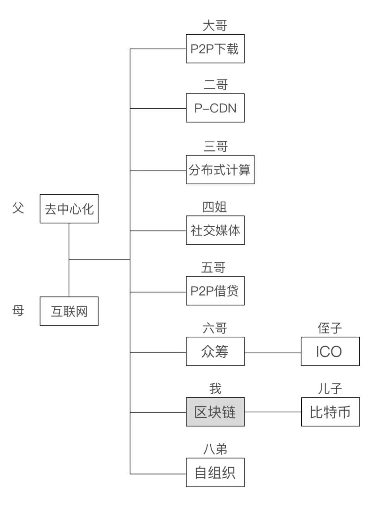

这是第一篇周报，开始写周报的原因是，之前跟风尝试过很多次日更，但是都失败了，没能坚持下去。
<!-- more -->
前几天在刷 twitter 的时候，看到一篇帖子提出了每个人都应该写一个周报来记录一下自己的日常。

所以就萌生了写周报的想法，日更坚持不下去，周更实现起来应该还可以吧。

希望这一次能坚持下去，记录一下自己的工作、学习、生活，分享一些自己的心得体会。

周报的构思很简单，每周末发布一篇周报，内容包括工作、学习、生活，每周末的工作总结、学习总结、生活总结，以及一些心得体会。

下面就是周报的正文内容啦。

## 阅读
最近在读《Smart Reading（英文原版 Grade 1-6）》，是一本跟美国学生同步阅读的英文读本。里面的内容分由易到难分为 6 个等级。

我目前的阅读等级是 3 级，这个等级的难度稍微有一点简单，单词量不是很多，句子难度也不大，很适合我目前的英文水平。

这周学到了一些新的表达，是关于量词的。类似于中文中，一支毛，一本书，一块橡皮等。

 a flock of sheep - 一群羊
 > 在英语中，“flock” 通常用于形容羊、鸟等动物群体，使用这个短语可以使描述更加生动形象。

 a herd of buffalo - 一群水牛

 > “herd” 在这里是一个量词，用于形容一群（大型的、群居的、有蹄类的哺乳动物）。它通常强调这些动物是作为一个整体被看待的，在行为上可能具有一定的一致性，比如一起移动、吃草等。除了水牛（buffalo），还可以用于形容 “a herd of cows（一群奶牛）”“a herd of deer（一群鹿）” 等。


 a litter of kittens - 一窝小猫
 > “litter” 在这里用于表示动物一胎所生的幼崽，尤其用于猫、狗等小型哺乳动物。例如，“The mother cat gave birth to a litter of kittens last night.（猫妈妈昨晚生了一窝小猫。）”

 a pod of seals - 一群海豚
 > “pod” 是一个冠词，用于形容一块（如肉、鱼、鸟、虫等）的小型容器。“A pod of seals” 指的是一群海豚。


 a pride of lions - 一群狮子
 > “pride” 是一个形容词，用于形容一群狮子，尤其是那些被视为领袖的狮子。“A pride of lions” 指的是一群狮子。

 a colony of penguins - 一群企鹅
 > “colony” 是一个名词，用于形容一群（如鸟、鱼、虫等）的聚居地。“A colony of penguins” 指的是一群企鹅。

 a swarm of bees - 一群蜜蜂
 > “swarm” 是一个名词，用于形容一群蜜蜂的集合。“A swarm of bees” 指的是一群蜜蜂。

 a gaggle of geese - 一群鸽子
 > “gaggle” 是一个名词，用于形容一群鸽子的集合。“A gaggle of geese” 指的是一群鸽子。

另外还看到一篇公众号文章，用家族的方式把区块链相关的一些事物都串联起来，很有意思。

原文链接：  <a href="https://mp.weixin.qq.com/s/IThlOMKpl6h_iCLMWzpomA">大家好，我就是区块链本人。今天，我要给你们介绍我的家族</a>

贴一张文中的区块链家族的族谱：



## 编程

在 vue3 中导入 assets 中的图片的方法。
```javascript
const images;
const imageModule = import.meta.glob('/src/assets/*.png');
const imagePaths = await Promise.all(Object.values(imageModule).map(async (importFunc) => (
    await importFunc()).default));
images = imagePaths;
```

在 vue3 中导入 public 中的图片的方法。
利用 node.js 的 fs 模块，可以读取 public 文件夹中的图片。
```javascript
// vite.config.js
export default {
    plugins: [
        {
            name: 'vite-plugin-public-path',
            transformIndexHtml: (html) => {
                const imagePath = path.resolve(__dirname, 'public','images');
                const imageNames = fs.readdirSync(imagePath)
                .filter(file => /\.(png|jpe?g|gif|svg)$/i.test(file));
            const imageNameScript = `<script>window.imageNames = ${JSON.stringify(imageNames)}</script>`;
            return html.replace('</head>', `${imageNameScript}</head>`);
            }
        }
    ]
}
```

