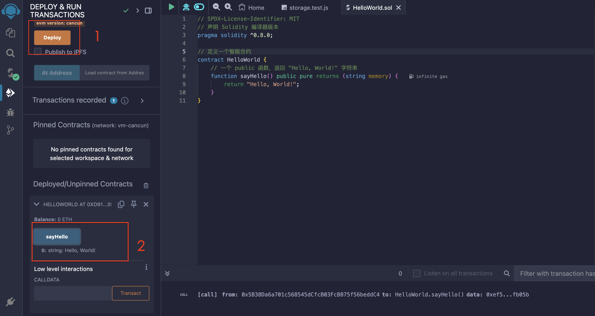

# 1.5 Hello World

前面几节介绍了 Solidity 的开发环境和基本语法规则，接下来我们来编写第一个 Solidity 的 Hello World。
<!-- more -->

```solidity
// SPDX-License-Identifier: MIT
// 声明 Solidity 编译器版本
pragma solidity ^0.8.0;

// 定义一个智能合约
contract HelloWorld {
    // 一个 public 函数，返回 "Hello, World!" 字符串
    function sayHello() public pure returns (string memory) {
        return "Hello, World!";
    }
}

```

1. 首先，声明了 Solidity 编译器版本，这里使用 `^0.8.0` 版本，表示该合约可以使用 0.8.0 及更高的小版本编译。。

2. 然后，定义了一个智能合约 `HelloWorld`，里面有一个 public 函数 `sayHello`，这个函数没有参数，返回值为 string 类型。

3. 在 `sayHello` 函数中，我们直接返回了字符串 `"Hello, World!"`。

4. 最后，我们编译并部署这个智能合约，然后调用 `sayHello` 函数，输出结果为 `"Hello, World!"`。

下面我们就在 Remix IDE 中试一下。

首先，我们在 contract 目录下新建一个文件，命名为 `HelloWorld.sol`，然后输入上面的代码。


然后，点击左上角的编译按钮，编译成功后，点击左上角的部署按钮，部署成功后，点击 `sayHello` 函数，可以看到返回结果为 `"Hello, World!"`。




到此一个简单的 Hello World 程序就编写完成了。打开 [Remix IDE](https://remix.ethereum.org/) ，开始动手吧！

## 总结

这一节终于开始进入写代码的环节了，我们编写了第一个 Solidity 程序，并在 Remix IDE 中测试运行。
建议大家代码不要直接复制粘贴，要自己敲一遍，这样可以加深印象，并且可以更好的理解并尽快熟悉 Solidity 的语法。
